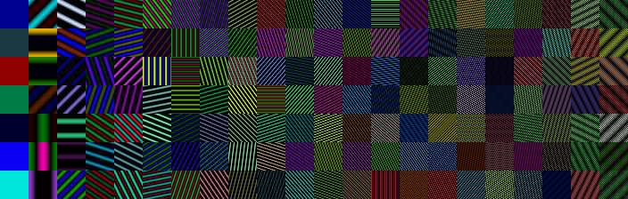

# Fourier Basis DB



## Usage

### Generating Fourier Basis DB

The script `apps/generate.py`
generates Fourier Basis DB (FBDB).

Example code:
```
cd apps
python generate.py class_type=l2 num_image_per_class=100 num_basis=31 image_size=32
```
will generate 32x32 FBDB by using 31x31 2D Fourier basis. 
The DB is saved under `logs/generate`. Currently, `l2, l1, full`  are supported as `class_type` option.

If you want to separate validation from train set.
Please specify `val_ratio` larger than 0.0 like follows.

Example code:
```
cd apps
python generate.py class_type=l2 num_image_per_class=100 num_basis=31 image_size=32 val_ratio=0.1
```

### Showing Sample Images

The script `apps/show_sample.py` 
randomly selects some images form generated FBDB and tiles them in a single image like teaser image of this repo. 

Example code:
```
cd apps
python show_sample.py db_path=[ABSOLUTE_PATH_TO_GENERATED_FBDB]
num_image_per_class=7
```
will generate sample_image and result is saved under logs/`show_sample`.